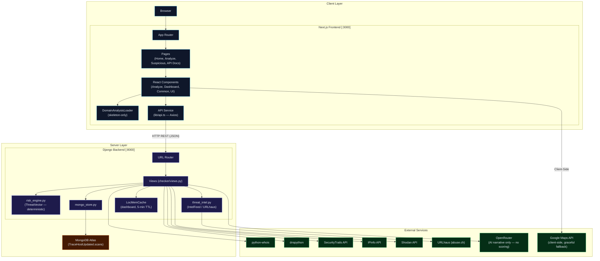
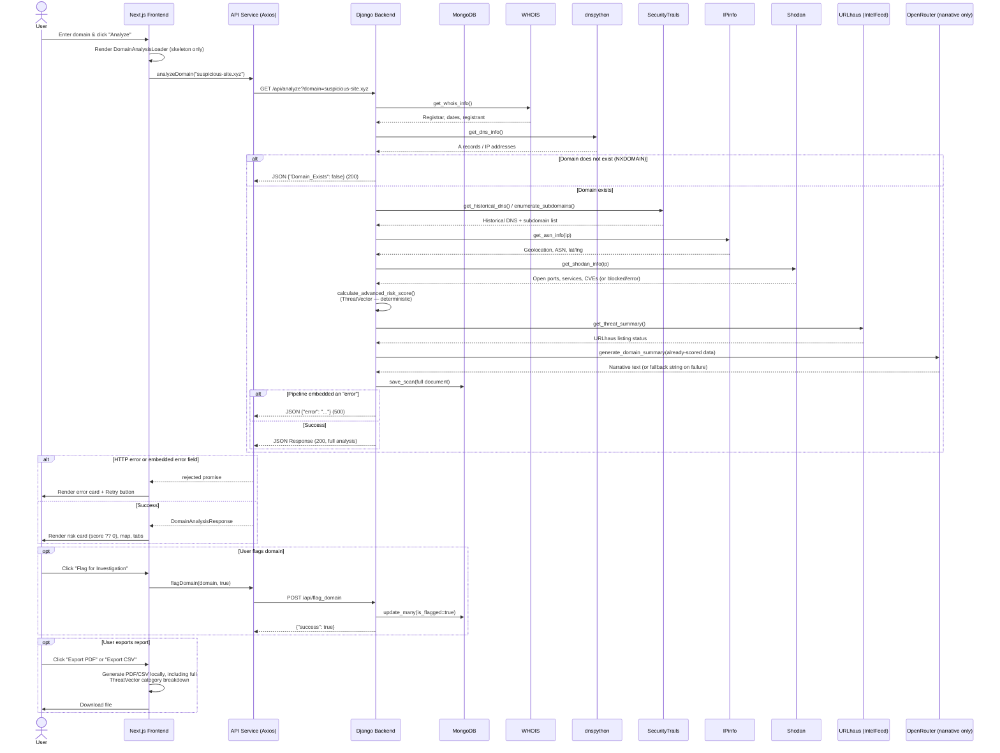
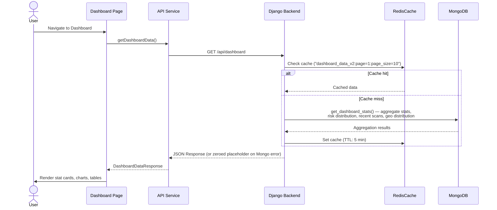

# TraceHost — Comprehensive Technical Documentation

> **Version:** 2.0 · **Last Updated:** July 2026 · **Author:** Atharva Dhavale

---

## Table of Contents

1. [Project Overview](#1-project-overview)
2. [Architecture Overview](#2-architecture-overview)
3. [Component-Level Breakdown](#3-component-level-breakdown)
4. [The ThreatVector Risk Engine](#4-the-threatvector-risk-engine)
5. [Functioning & Logic Flow](#5-functioning--logic-flow)
6. [API & Data Models](#6-api--data-models)
7. [Architecture Diagram (Mermaid.js)](#7-architecture-diagram)
8. [Sequence Diagram (Mermaid.js)](#8-sequence-diagram)
9. [Environment & Configuration](#9-environment--configuration)
10. [Getting Started](#10-getting-started)
11. [Known Limitations & Assumptions](#11-known-limitations--assumptions)

---

## 1. Project Overview

### Purpose

**TraceHost** is a domain intelligence and security analysis platform. Given a domain name, it aggregates WHOIS, DNS, geolocation, network-exposure (Shodan), and public threat-feed (URLhaus) data, runs it through a deterministic multi-factor scoring engine (**ThreatVector**), and generates an AI-written narrative summary — all surfaced through a dark-themed Next.js dashboard.

### Core Value Proposition

| Capability | Description |
|---|---|
| **ThreatVector Risk Scoring** | Deterministic, rule-based 0–100 score across four weighted categories — every point is traceable to an explicit factor, not an opaque LLM judgment |
| **BrandShield™** | Brand-impersonation / typosquat detection (Levenshtein distance + evidence-gated substring matching) |
| **IntelFeed™** | Live cross-reference against the URLhaus (abuse.ch) malicious-URL feed |
| **Multi-Source Intelligence** | WHOIS, DNS (+ historical via SecurityTrails), Shodan network exposure, IPinfo geolocation |
| **AI Narrative Summary** | An LLM (via OpenRouter) turns the structured scan data into a readable summary — narrative only, it does not compute the risk score |
| **Geolocation Mapping** | Server location on an interactive Google Map, with a graceful fallback if the Maps API is unavailable |
| **Domain Flagging** | Flag/unflag domains for ongoing investigation (persisted in MongoDB) |
| **Report Export** | PDF (jsPDF) and CSV export including the full ThreatVector category breakdown |
| **Scan History** | Every analysis is persisted to MongoDB, so a domain's risk score over time can be retrieved |

### Tech Stack

| Layer | Technology | Version |
|---|---|---|
| **Frontend Framework** | Next.js (App Router) | 13.5.1 |
| **Language (Frontend)** | TypeScript | 5.2.2 |
| **UI Library** | React | 18.2.0 |
| **Styling** | Tailwind CSS | 3.3.3 |
| **Component Library** | Radix UI (via shadcn/ui) | Multiple packages |
| **PDF Generation** | jsPDF + jsPDF-AutoTable | ^3.0.1 / ^5.0.2 |
| **Animations** | Framer Motion | ^12.5.0 |
| **HTTP Client** | Axios | ^1.8.4 |
| **Maps** | `@googlemaps/js-api-loader` | latest |
| **Backend Framework** | Django | 4.2.10 |
| **Language (Backend)** | Python | 3.12 |
| **REST API** | Django REST Framework | 3.14.0 |
| **Primary Datastore** | **MongoDB Atlas** (`TraceHostUpdated` DB) | pymongo 4.17.0 |
| **Legacy Datastore** | SQLite (`db.sqlite3`) — Django's own tables only; **not used for scan data** | — |
| **AI (narrative summary only)** | OpenRouter (default model `openai/gpt-oss-120b:free`) | via `requests` |
| **DNS Resolution** | dnspython | 2.6.1 |
| **WHOIS Lookup** | python-whois | 0.8.0 |
| **Public Suffix Parsing** | tldextract (offline PSL snapshot, no network calls) | latest |
| **IP Intelligence** | IPinfo | 4.4.3 |
| **Network Recon** | Shodan API | 1.30.1 |
| **Threat Feed** | URLhaus (abuse.ch) — requires a free `Auth-Key` | via `requests` |
| **Fuzzy Matching** | python-Levenshtein | 0.27.3 |
| **CORS** | django-cors-headers | 4.3.1 |

> **Note on the AI:** the "AI" in TraceHost is used **only** to write the human-readable narrative (`AI_Summary` field) from data the ThreatVector engine has already computed. The risk score itself is 100% deterministic Python — the LLM never sees or influences `risk_score`. If the OpenRouter call fails or is rate-limited, the score and breakdown are unaffected; only the narrative text degrades to a canned fallback string.

---

## 2. Architecture Overview

### Structural Pattern

TraceHost follows a **Decoupled Client-Server (Two-Tier) Architecture**.

```
┌─────────────────────────────────────────────────────────────────┐
│                        CLIENT (Browser)                        │
│  ┌──────────────────────────────────────────────────────────┐   │
│  │           Next.js Frontend (Port 3000)                   │   │
│  │   App Router  ─▶  Components  ─▶  API Service (Axios)   │   │
│  └──────────────────────────┬───────────────────────────────┘   │
│                             │ HTTP (REST / JSON)                │
│  ┌──────────────────────────▼───────────────────────────────┐   │
│  │           Django Backend  (Port 8000)                    │   │
│  │  URL Router ─▶ Views ─▶ risk_engine.py (ThreatVector)    │   │
│  │                    │            │                        │   │
│  │                    │            ▼                        │   │
│  │                    │      threat_intel.py (URLhaus)       │   │
│  │                    ▼                                    │   │
│  │            mongo_store.py ─▶ MongoDB Atlas               │   │
│  │                    │                                    │   │
│  │                    ▼                                    │   │
│  │   External APIs (WHOIS, DNS, IPinfo, Shodan, SecurityTrails,│ │
│  │                   OpenRouter — narrative only)            │   │
│  └──────────────────────────────────────────────────────────┘   │
└─────────────────────────────────────────────────────────────────┘
```

**Key architectural decisions:**

- **Frontend renders on the client** (`"use client"` components) — the Next.js app is effectively an SPA over a REST backend.
- **Backend uses Redis caching for hot read paths** — `/api/analyze` responses are cached per normalized domain, and `/api/dashboard` responses are cached per page/page_size combination. Persistence to MongoDB is still the system of record; Redis is only a short-lived acceleration layer.
- **Scoring is deterministic and server-side, independent of the AI call** — see [§4](#4-the-threatvector-risk-engine).
- **AI narrative generation is isolated** to `generate_domain_summary()` in `views.py`; a failure there degrades gracefully to canned text and never blocks the response or alters the score.
- **Dashboard/aggregate reads are cached** via Django's Redis cache backend (5-minute TTL); the frontend also keeps a short-lived in-memory `Map` cache in `lib/api.ts`.

---

## 3. Component-Level Breakdown

### 3.1 Backend — `Backend/`

#### 3.1.1 `website_checker/` — Django Project Configuration

| File | Responsibility |
|---|---|
| `settings.py` | Installed apps, CORS, middleware, Redis cache config, REST framework config. `DATABASES` still points at SQLite for Django's own bookkeeping (sessions/admin) — **scan data lives in MongoDB, not here**. |
| `urls.py` | Root URL dispatcher: `/admin/`, `/api/*` → `checker.urls`, and a root-level `/health` alias |
| `wsgi.py` / `asgi.py` | Deployment entry points |

#### 3.1.2 `project/` — Alternative/Production Project Configuration

A secondary, hardened settings module (`SECRET_KEY` from env, `CORS_ALLOW_ALL_ORIGINS = False`, security headers). Not the module used by `manage.py runserver` in local dev (`website_checker.settings` is), kept for production deployment reference.

#### 3.1.3 `checker/` — Core Application

| File | Responsibility |
|---|---|
| `models.py` | Legacy `DomainScan` Django model. **No longer read or written by any view** — all scan persistence goes through `mongo_store.py` / MongoDB instead. Retained for backward compatibility with the SQLite migration history only. |
| `views.py` | API view functions, external-API integration helpers, Redis cache orchestration, and the analysis pipeline orchestration (571 lines) |
| `risk_engine.py` | **ThreatVector Engine** — deterministic multi-factor domain risk scoring (553 lines). See [§4](#4-the-threatvector-risk-engine). |
| `threat_intel.py` | URLhaus (abuse.ch) threat-feed integration |
| `mongo_store.py` | All MongoDB read/write operations: `save_scan`, `flag_domain`, `get_domain_history`, `get_dashboard_stats`, `get_suspicious_domains`, etc. |
| `urls.py` | URL routing for all `/api/*` endpoints |
| `admin.py` / `apps.py` | Django admin registration / app config (minimal) |
| `migrations/` | Historical migrations for the now-unused `DomainScan` model |

**Key functions in `views.py`:**

| Function | Description |
|---|---|
| `get_whois_info(domain)` | WHOIS registrar/registrant/date lookup via `python-whois` |
| `get_dns_info(domain)` | Resolves `A` records via `dnspython`; distinguishes `NXDOMAIN` (domain doesn't exist) from other resolution failures |
| `get_historical_dns(domain)` | Historical DNS via SecurityTrails |
| `enumerate_subdomains(domain)` | Subdomain discovery via SecurityTrails |
| `get_ssl_cert_logs(domain)` | Certificate-transparency logs from `crt.sh` (currently fetched but not surfaced in the API response) |
| `get_shodan_info(ip)` | Open ports, services, CVEs, banner data from Shodan |
| `get_asn_info(ip)` | Geolocation + ASN via IPinfo |
| `generate_domain_summary(domain_data)` | Builds the OpenRouter prompt and returns the narrative `AI_Summary` string; **never influences `risk_score`** |
| `analyze_domain_for_response(domain)` | Orchestrates the full pipeline: WHOIS → DNS → historical DNS/subdomains → ASN → Shodan → `calculate_advanced_risk_score()` → URLhaus → AI narrative → MongoDB persistence |
| `analyze_domain(request)` | `GET /api/analyze` — validates input, calls the pipeline, caches successful responses in Redis, and **returns HTTP 500 if the pipeline embeds an `"error"` key** (so the frontend's axios call correctly rejects instead of silently rendering a broken result) |
| `suspicious_view(request)` | `GET /api/suspicious` — re-runs the analysis pipeline on demand |
| `get_dashboard_data(request)` | `GET /api/dashboard` — Redis-cached aggregate stats from MongoDB, keyed by page and page size |
| `suspicious_domains_list(request)` | `GET /api/suspicious_domains` — paginated/filterable list from MongoDB |
| `scan_history(request)` | `GET /api/scan_history` — a domain's historical scans from MongoDB |
| `flag_domain(request)` | `POST /api/flag_domain` — sets/clears `is_flagged` across all of a domain's MongoDB scan records and invalidates dashboard cache entries |
| `health_check(request)` | `GET /api/health` and `GET /health` — liveness probe |
| `call_with_retry(func, ...)` | Generic retry wrapper (max 3 attempts, 1s backoff) used around the OpenRouter call |

---

### 3.2 Frontend — `Frontend/`

#### 3.2.1 `app/` — Next.js App Router (Pages)

| Path | Description |
|---|---|
| `app/page.tsx` | Landing page — hero, search bar, feature cards |
| `app/layout.tsx` | Root layout (`ThemeProvider`, `Header`, `Footer`, `Toaster`) |
| `app/analyze/page.tsx` | Domain-analysis entry form |
| `app/analyze/[domain]/page.tsx` | Dynamic route rendering `<DomainResults domain={...}>` |
| `app/analyze/results/page.tsx` | Alternate results route |
| `app/suspicious/page.tsx` | Paginated table of suspicious/flagged domains |
| `app/api-docs/page.tsx` | Built-in API documentation page |
| `app/test-pdf/page.tsx` | PDF export testing page |

#### 3.2.2 `components/analyze/` — Analysis Feature Components

| File | Description |
|---|---|
| `domain-form.tsx` | Domain input, validates and navigates to `/analyze/[domain]` |
| `domain-results.tsx` | **Main results view** — orchestrates the fetch, loading/error states, risk-score card, tabs (Summary / AI Analysis / Threat Intel / WHOIS / DNS & SSL / Subdomains / Security / Risk Analysis), and PDF/CSV export |
| `domain-analysis-loader.tsx` | Skeleton-only loading screen shown while `/api/analyze` is in flight — deliberately shows **no per-field data or backend-stage labels**, only layout-shaped placeholders, so nothing implies partial/available data before the request actually completes |
| `risk-breakdown.tsx` | Renders the ThreatVector category breakdown (scores, factors, entropy, BrandShield/IntelFeed alerts) in the "Risk Analysis" tab |
| `google-map.tsx` | Google Maps JS SDK integration for server geolocation. Registers a `window.gm_authFailure` hook so a blocked/misconfigured API key (billing, referrer restriction, API not activated) falls back to a clean "Map preview unavailable" placeholder instead of surfacing Google's raw error dialog |
| `dns-info.tsx`, `subdomains-list.tsx`, `map-component.tsx` | Standalone/legacy components not currently rendered by `domain-results.tsx` (which renders its own inline DNS table, subdomain grid, and `GoogleMap` instead) — kept for potential reuse |

#### 3.2.3 `components/dashboard/`, `components/common/`, `components/layout/`

Unchanged in role from prior versions: dashboard stat cards/charts (Recharts), the header's search bar and API-status indicator, and the app shell.

#### 3.2.4 `components/ui/` — shadcn/ui primitives

Radix-based design-system components (`button`, `card`, `tabs`, `skeleton`, `progress`, `toast`, etc.).

#### 3.2.5 `lib/`

| File | Description |
|---|---|
| `api.ts` | Axios instance + typed API surface (`analyzeDomain`, `flagDomain`, `getSuspiciousAnalysis`, dashboard/history calls) and all `DomainAnalysisResponse` / `RiskBreakdownData` / `ThreatIntelData` TypeScript interfaces |
| `utils.ts` | `cn()` class-merging helper |
| `hooks/use-media-query.ts` | Responsive breakpoint hook |

---

## 4. The ThreatVector Risk Engine

`Backend/checker/risk_engine.py` is the authoritative source of `risk_score`. It is a **pure function of its inputs** — same domain/WHOIS/DNS/ASN/Shodan data always produces the same score and the same factor list. It is not an ML model and does not call any external service; it exists specifically so every point on the 0–100 scale is explainable.

### 4.1 Category weighting (sums to 100)

| Category | Max | Signals |
|---|---|---|
| **Domain Name Analysis** | 30 | Shannon entropy (DGA detection), BrandShield™ impersonation match, phishing keywords in host labels, high-risk TLD, excessive hyphens, IDN/punycode homograph, leetspeak digit substitution |
| **Registration Intelligence** | 25 | Domain age (newer = riskier), WHOIS lookup failure, missing registrar, undisclosed registrant organization/name, unusually short registration window |
| **Infrastructure Profiling** | 25 | Hosting country risk (ISO country code), known bulletproof-hosting ASN, dangerous open ports / CVEs / large attack surface (Shodan), or an explicit "exposure unverifiable" factor when Shodan itself is blocked/rate-limited |
| **DNS Pattern Analysis** | 20 | Fast-flux-style A-record volume, resolution failures |

`total = min(100, domain_name + registration + infrastructure + dns_analysis)`.

### 4.2 Trusted-suffix fast path

Registry-restricted institutional suffixes (`.edu`, `.gov`, `.mil`, `.int`, and second-level equivalents like `ac.uk` / `gov.in` / `edu.au`) short-circuit to a flat score of **8** with an `override` note, since these registries gate who can register at all. This is intentionally narrow — generic ccTLDs that merely *resemble* trusted suffixes (e.g. bare `.ac`, which is Ascension Island's openly-registrable ccTLD) are **not** trusted, so `paypal-login.ac` is scored normally rather than bypassing analysis.

### 4.3 BrandShield™ (`find_brand_similarity`)

Domains are split via `tldextract` against an offline Public Suffix List snapshot (deterministic, no network call), so `example.co.uk` is correctly parsed as label `example` / suffix `co.uk` rather than misreading `co` as the registrable name. A match requires one of:

1. Exact registrable label equals a stripped brand hidden behind a phishing prefix/suffix (`my-ebay.com` → `ebay`, 100% similarity).
2. The brand string embedded in the label **with corroborating evidence** — a separator or digit adjacent to the brand, or a phishing keyword elsewhere in the label. This gate exists specifically to avoid flagging ordinary words that happen to contain a brand name (`steamship.com`, `applesauce.com`) as phishing.
3. Levenshtein-distance typosquatting against the label (minimum length 5 on both sides, distance ≤ 2 or ratio ≤ 25%) — catches `paypa1.com` without false-flagging short dictionary words like `case.com` against `chase`.

### 4.4 IntelFeed™ (`threat_intel.py`)

Queries `urlhaus-api.abuse.ch` for the domain. abuse.ch now requires a free `Auth-Key` for API access — without `URLHAUS_AUTH_KEY` set in `Backend/.env`, the feed reports `listed: null` ("unknown/unauthenticated") rather than a false "clean," and `views.py` adds a score bonus (+10 to +20) only when the feed positively confirms a listing.

### 4.5 Uncertainty vs. concealment

A recurring design principle: **inability to verify something is scored as a small, distinct uncertainty factor, not conflated with evidence of wrongdoing.** For example, a WHOIS query that fails outright (timeout, rate-limit) contributes a single flat +8 "registration data unavailable" factor rather than stacking every individual "field missing" penalty against a domain that simply couldn't be queried. Similarly, a Shodan scan that returns HTTP 403 (blocked/rate-limited) adds a modest "+4 network exposure could not be verified" factor — this is *why* an old, low-risk domain can still show a small non-zero score (e.g. `1eq.com` scoring 7/100 — undisclosed registrant org (+3) plus a temporarily-blocked Shodan check (+4) — while the domain has no real malicious indicators). Genuine unknowns are never rounded down to a false "0% risk."

---

## 5. Functioning & Logic Flow

### 5.1 Life of a Request — "Analyze Domain"

#### Step 1: User Input (Frontend)

1. User enters a domain in `DomainForm` or the header search bar.
2. On submit, the app navigates client-side to `/analyze/[domain]`.

#### Step 2: Loading State (Frontend)

3. `DomainResults` mounts, sets `isLoading = true`, and renders `DomainAnalysisLoader` — a skeleton-only placeholder that mirrors the results layout but reveals no data or backend-stage information, since the request hasn't resolved yet.
4. `analyzeDomain(domain)` (in `lib/api.ts`) issues `GET {API_BASE_URL}/api/analyze?domain=...` via Axios.

#### Step 3: Request Processing (Backend)

5. Django routes `/api/analyze` → `views.analyze_domain(request)`.
6. `analyze_domain_for_response(domain)` runs the full pipeline (see below). If it returns a payload with an `"error"` key, the view responds with **HTTP 500** — not 200 — so Axios rejects and the frontend never renders a partial/broken result as a success.

#### Step 4: Intelligence Gathering

7. **WHOIS** — `get_whois_info()`.
8. **DNS** — `get_dns_info()`; on `NXDOMAIN` the pipeline short-circuits and returns a `Domain_Exists: false` payload immediately (no further lookups).
9. **Historical DNS** and **Subdomains** — SecurityTrails.
10. **ASN/Geolocation** — `get_asn_info()` (IPinfo).
11. **Shodan** — `get_shodan_info()` for open ports/services/CVEs (skipped if DNS resolved no IP).

#### Step 5: Deterministic Risk Scoring

12. `calculate_advanced_risk_score()` (ThreatVector Engine, [§4](#4-the-threatvector-risk-engine)) returns `(risk_score, risk_breakdown)`.
13. `get_threat_summary()` (IntelFeed/URLhaus) runs; a confirmed listing adds a bonus to `risk_score` and a factor to the breakdown.

#### Step 6: AI Narrative (non-scoring)

14. `generate_domain_summary()` sends the already-computed structured data to OpenRouter and returns a multi-section narrative string (`AI_Summary`). A failure here (timeout, 429 rate limit) degrades to a canned fallback string — it never blocks the response or changes `risk_score`.

#### Step 7: Persistence & Response

15. The full scan document (including WHOIS, ASN, Shodan, risk breakdown, threat intel, and AI summary) is inserted into MongoDB via `mongo_store.save_scan()` — every scan is a new history record, never overwritten.
16. `JsonResponse(result)` is returned (200 on success, 500 if the pipeline errored).

#### Step 8: Results Display (Frontend)

17. `DomainResults` additionally checks the response body itself for an `error` field (defense in depth even on a 200) before calling `setData()` — so a genuinely broken payload is treated as a failure regardless of HTTP status.
18. Renders: risk-score card (uses `?? 0`, never a truthy-fallback default, so a real score of `0` displays correctly instead of being masked by a stale default), server-location card with map, registration card, and the tabbed detail views (Summary, AI Analysis, Threat Intel, WHOIS, DNS & SSL, Subdomains, Security, Risk Analysis).
19. User may **flag** the domain (`POST /api/flag_domain`) or **export** as PDF/CSV — both exports include the full ThreatVector category breakdown, BrandShield match, and URLhaus status, not just the flattened legacy factor list.

### 5.2 Life of a Request — "Dashboard View"

1. Frontend calls `GET /api/dashboard`.
2. Backend checks `LocMemCache` (`dashboard_data_v2`, 5-min TTL).
3. On a cache miss, `mongo_store.get_dashboard_stats()` aggregates: basic stats, time-based stats, risk-score distribution, recent scans, top-suspicious, geo distribution — all from the MongoDB `scans` collection.
4. Result is cached and returned; on any MongoDB error the endpoint returns a zeroed-out placeholder shape rather than a 500, so the dashboard UI never crashes on a datastore hiccup.

---

## 6. API & Data Models

### 6.1 Data Model — MongoDB `scans` collection

Each analysis inserts a new document (full history is kept; nothing is overwritten in place). Indexed fields: `domain`, `scan_date`, `risk_score`, `is_suspicious`, `is_flagged`, `country`.

```text
{
  domain, ip_address, risk_score, is_suspicious, is_flagged,
  country, city, registrar, creation_date, expiration_date,
  category,      # "Phishing" | "Suspicious" | "Flagged" | "Clean"
  status,        # "Active"
  risk_breakdown, threat_intel, whois_info, asn_info, shodan_info,
  subdomains, ai_summary, scan_date
}
```

> The Django `DomainScan` model in `models.py` (backed by SQLite) is **not used** for this data — it predates the MongoDB migration and is retained only so historical migrations still apply cleanly.

### 6.2 API Endpoints

All endpoints are prefixed with `/api/` (see `checker/urls.py`); a root-level `/health` alias also exists.

#### `GET /api/analyze`

Full domain security analysis.

| Parameter | Type | Required | Description |
|---|---|---|---|
| `domain` | string | Yes | Domain name to analyze |

**Response (200) — abbreviated:**
```json
{
  "Domain": "example.com",
  "Domain_Exists": true,
  "IP_Address": "93.184.216.34",
  "ASN_Info": { "asn": "AS15133 Edgecast Inc.", "city": "Norwell", "country": "US", "country_code": "US", "latitude": "42.1596", "longitude": "-70.8167" },
  "Registrar": "...", "Creation_Date": "...", "Expiration_Date": "...",
  "Registrant_Name": "...", "Registrant_Organization": "...",
  "Subdomains": ["www", "mail"],
  "Historical_DNS": [ { "type": "A", "value": "...", "ttl": 3600 } ],
  "Security_Analysis": { "result": ["..."], "is_suspicious": false, "risk_score": 7 },
  "Risk_Breakdown": {
    "domain_name":    { "score": 0, "max": 30, "factors": [] },
    "registration":   { "score": 3, "max": 25, "factors": ["Registrant organization not disclosed (+3)"] },
    "infrastructure": { "score": 4, "max": 25, "factors": ["Network exposure could not be verified — Shodan scan blocked or unavailable (+4)"] },
    "dns_analysis":   { "score": 0, "max": 20, "factors": [] },
    "total": 7, "entropy": 1.58
  },
  "Threat_Intel": { "threat_level": "unknown", "listed_on_feeds": 0, "feeds": { "urlhaus": { "listed": null, "error": "URLhaus API requires an Auth-Key..." } } },
  "Shodan_Info": { "ip": "...", "ports": [80], "vulns": [], "services": [...] },
  "AI_Summary": "Summary\nThis domain appears to be legitimate..."
}
```

**Response (500)** — on internal pipeline failure: `{"Domain": "...", "error": "Analysis failed: ...", "Domain_Exists": true}`. Prior to July 2026 this was incorrectly returned with HTTP 200, causing the frontend to sometimes render a broken result as a success; both the status code and a frontend-side `error`-field check now guard against this.

#### `GET /api/suspicious`

Re-analyzes a domain on demand; `{"domain": "...", "analysis": {...same shape as /api/analyze...}}`.

#### `GET /api/dashboard`

Aggregated MongoDB analytics. `page`, `page_size` query params for the embedded recent-scans list.

#### `GET /api/suspicious_domains`

Paginated/filterable domain list. Params: `page`, `limit`, `search`, `filter`.

#### `GET /api/scan_history`

Historical scans for one domain. Params: `domain` (required), `limit` (default 10, capped at 50).

#### `POST /api/flag_domain`

```json
// Request
{ "domain": "suspicious-site.xyz", "flag": true }
// Response (200)
{ "success": true, "domain": "suspicious-site.xyz", "is_flagged": true, "message": "Domain flagged successfully" }
```

#### `GET /api/health` (and root `GET /health`)

`{ "status": "ok", "version": "2.0" }`

---

## 7. Architecture Diagram



---

## 8. Sequence Diagram

### 8.1 Core Flow — Domain Analysis



### 8.2 Dashboard Data Flow



---

## 9. Environment & Configuration

### Client-Side (`Frontend/.env.local`)

| Variable | Purpose | Default |
|---|---|---|
| `NEXT_PUBLIC_API_URL` | Backend API base URL | `http://localhost:8000` |
| `NEXT_PUBLIC_BACKEND_URL` | Backend server URL (fallback if `NEXT_PUBLIC_API_URL` unset) | `http://localhost:8000` |
| `NEXT_PUBLIC_GOOGLE_MAPS_API_KEY` | Google Maps for server-location rendering | — |
| `NEXT_PUBLIC_API_TOKEN` | Bearer token attached to outgoing API requests, if set | — |
| `NEXT_PUBLIC_CACHE_TTL` | Client-side response cache duration (seconds) | `300` |
| `NEXT_PUBLIC_REQUEST_TIMEOUT` | Axios timeout (ms) | `120000` |
| `NEXT_PUBLIC_FETCH_TIMEOUT` | Fetch abort timeout (ms) | `10000` |
| `NEXT_PUBLIC_ENABLE_API_LOGGING` | Verbose API logging | `true` |

### Server-Side (`Backend/.env`)

| Variable | Purpose | Required |
|---|---|---|
| `MONGO_URI` | MongoDB Atlas connection string (DB name read from the URI path) | **Yes** |
| `IPINFO_API_KEY` | IPinfo geolocation service | Yes |
| `SHODAN_API_KEY` | Shodan network reconnaissance | Yes |
| `SECURITY_TRAILS_API_KEY` | SecurityTrails DNS history/subdomains | Yes |
| `OPENROUTER_API_KEY` | AI narrative summary generation | Yes (narrative degrades gracefully without it) |
| `OPENROUTER_MODEL` | Model id | `openai/gpt-oss-120b:free` |
| `URLHAUS_AUTH_KEY` | Free abuse.ch Auth-Key — without it, IntelFeed reports `listed: null` instead of live data | Recommended |
| `REDIS_URL` | Redis connection string used for domain and dashboard response caching | `redis://127.0.0.1:6379/1` |
| `NEO4J_URI` | Neo4j Aura connection URI for the attack-surface graph | Recommended |
| `NEO4J_USER` | Neo4j Aura username | Recommended |
| `NEO4J_PASSWORD` | Neo4j Aura password | Recommended |

---

## 10. Getting Started

### Prerequisites

- **Node.js** 18.x+
- **Python** 3.12
- **pip**

### One-command startup

```bash
./start-dev.sh   # from the repo root — starts both servers, tails logs
```

### Manual setup

```bash
# Backend
cd Backend/
python3 -m venv venv && source venv/bin/activate
pip install -r requirements.txt
cp ../.env.example .env   # fill in real values
python manage.py migrate
python manage.py runserver 8000

# Frontend (separate shell)
cd Frontend/
npm install
cp ../.env.example .env.local   # fill in real values
npm run dev   # serves on :3000 (auto-increments if occupied)
```

### Access the Application

- **Frontend:** [http://localhost:3000](http://localhost:3000)
- **Backend API:** [http://localhost:8000/api/](http://localhost:8000/api/)
- **Health check:** [http://localhost:8000/health](http://localhost:8000/health)

---

## 11. Known Limitations & Assumptions

- **IntelFeed is inert without `URLHAUS_AUTH_KEY`** — abuse.ch's public API now requires authentication; the feed correctly reports "unknown" rather than a false negative, but won't detect real listings until a key is configured.
- **URLhaus score bonus can desync category sum from total** — a confirmed URLhaus listing raises `risk_score` directly in `views.py` without a matching increase to any one `Risk_Breakdown` category, so `domain_name + registration + infrastructure + dns_analysis` can be less than `total` in that specific case. This is a known, deliberate trade-off pending a product decision on which category should absorb feed-based intelligence.
- **`crt.sh` SSL certificate-transparency data is fetched (`get_ssl_cert_logs`) but not currently included in the API response** — the frontend's "DNS & SSL" tab shows a placeholder for detailed certificate info.
- **Legacy dead code retained, not removed:** the SQLite-backed `DomainScan` Django model (`models.py`), and the frontend's `dns-info.tsx` / `subdomains-list.tsx` / `map-component.tsx` components, are unused by the current code paths but kept in the tree pending an explicit cleanup pass.
- **Country-risk weighting is a heuristic, not an accusation** — `HIGH_RISK_COUNTRIES` reflects elevated statistical prevalence of abuse hosting, not a claim that hosting in a given country is itself malicious.
- **Brand/keyword matching is tuned for precision over recall** — the evidence-gating in BrandShield™ (§4.3) intentionally accepts missing some obscure impersonation patterns in exchange for not flagging legitimate domains that happen to contain a brand-like substring.

---

> **TraceHost** — Secure Domain Intelligence for Modern Threats
