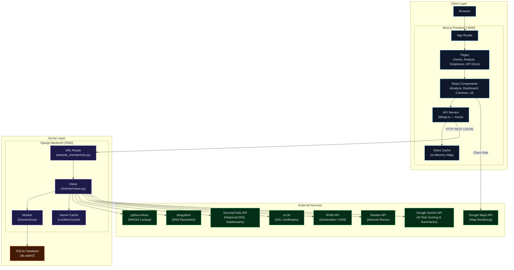
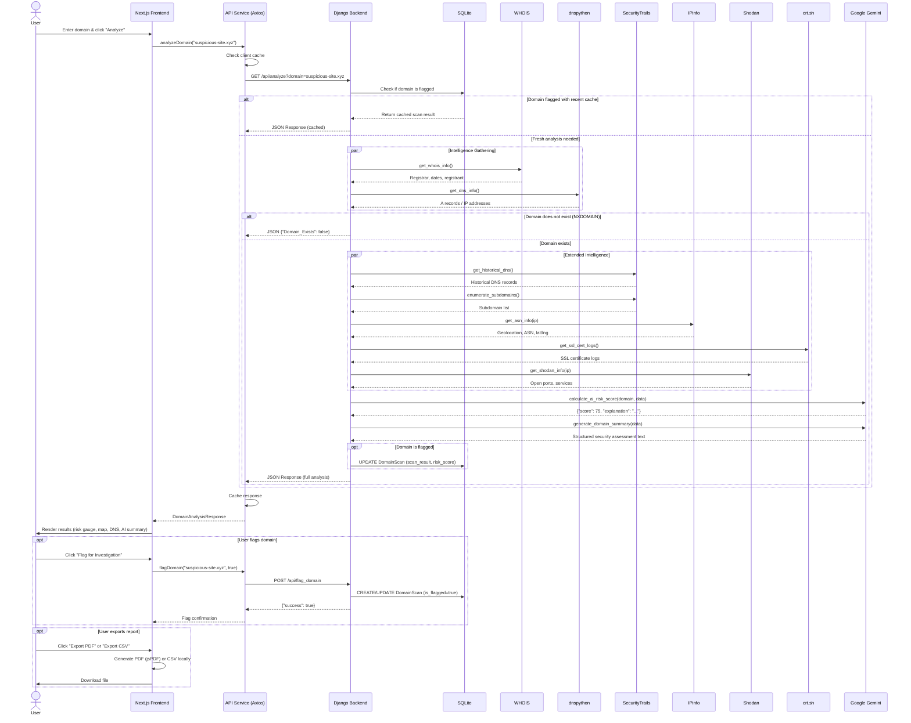
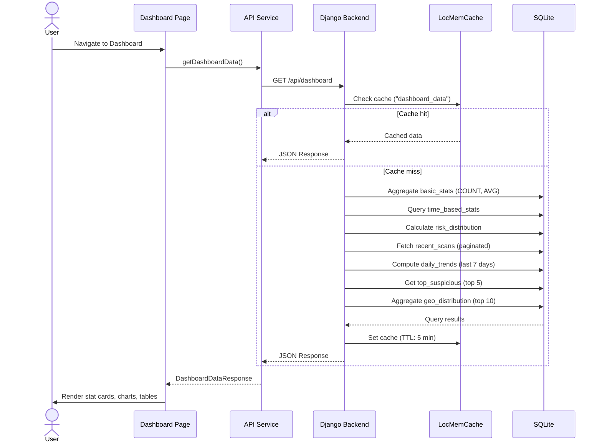

# TraceHost — Comprehensive Technical Documentation

> **Version:** 1.0 · **Last Updated:** February 2026 · **Author:** Atharva Dhavale

---

## Table of Contents

1. [Project Overview](#1-project-overview)
2. [Architecture Overview](#2-architecture-overview)
3. [Component-Level Breakdown](#3-component-level-breakdown)
4. [Functioning & Logic Flow](#4-functioning--logic-flow)
5. [API & Data Models](#5-api--data-models)
6. [Architecture Diagram (Mermaid.js)](#6-architecture-diagram)
7. [Sequence Diagram (Mermaid.js)](#7-sequence-diagram)
8. [Environment & Configuration](#8-environment--configuration)
9. [Getting Started](#9-getting-started)

---

## 1. Project Overview

### Purpose

**TraceHost** is a domain intelligence and security analysis platform that enables users to analyze any internet domain for suspicious activity, security threats, and malicious behavior. It aggregates data from multiple threat intelligence sources, applies AI-powered risk scoring via Google Gemini, and presents the results through a modern, dark-themed web dashboard.

### Core Value Proposition

| Capability | Description |
|---|---|
| **AI-Powered Risk Scoring** | Uses Google Gemini to analyze domain characteristics and compute a 0–100 risk score |
| **Multi-Source Intelligence** | Aggregates WHOIS, DNS, SecurityTrails, Shodan, IPinfo, and SSL certificate data |
| **Real-Time Analysis** | On-demand domain scanning with streaming response support |
| **Geolocation Mapping** | Visualizes server locations on an interactive Google Map |
| **Domain Flagging** | Allows users to flag/unflag domains for ongoing investigation |
| **Report Export** | Generates downloadable PDF and CSV reports of analysis results |
| **Analytics Dashboard** | Displays scan statistics, risk distributions, and trend charts |

### Tech Stack

| Layer | Technology | Version |
|---|---|---|
| **Frontend Framework** | Next.js (App Router) | 13.5.1 |
| **Language (Frontend)** | TypeScript | 5.2.2 |
| **UI Library** | React | 18.2.0 |
| **Styling** | Tailwind CSS | 3.3.3 |
| **Component Library** | Radix UI (via shadcn/ui) | Multiple packages |
| **Charts** | Recharts | 2.12.7 |
| **PDF Generation** | jsPDF + jsPDF-AutoTable | 3.0.1 / 5.0.2 |
| **Animations** | Framer Motion | 12.5.0 |
| **HTTP Client** | Axios | 1.8.4 |
| **Backend Framework** | Django | 4.2.10 |
| **Language (Backend)** | Python | 3.x |
| **REST API** | Django REST Framework | 3.14.0 |
| **Database** | SQLite | 3 |
| **AI / LLM** | Google Gemini (gemini-2.0-flash) | via `google-generativeai` 0.3.2 |
| **DNS Resolution** | dnspython | 2.4.2 |
| **WHOIS Lookup** | python-whois | 0.8.0 |
| **IP Intelligence** | IPinfo | 4.4.3 |
| **Network Recon** | Shodan API | 1.30.1 |
| **CORS** | django-cors-headers | 4.3.1 |

---

## 2. Architecture Overview

### Structural Pattern

TraceHost follows a **Decoupled Client-Server (Two-Tier) Architecture** with a clear separation between the frontend presentation layer and the backend API layer.

```
┌─────────────────────────────────────────────────────────────────┐
│                        CLIENT (Browser)                        │
│  ┌──────────────────────────────────────────────────────────┐   │
│  │           Next.js Frontend (Port 3000)                   │   │
│  │   App Router  ─▶  Components  ─▶  API Service (Axios)   │   │
│  └──────────────────────────┬───────────────────────────────┘   │
│                             │ HTTP (REST / JSON)                │
│  ┌──────────────────────────▼───────────────────────────────┐   │
│  │           Django Backend  (Port 5000)                    │   │
│  │   URL Router  ─▶  Views  ─▶  Models  ─▶  SQLite DB      │   │
│  │                     │                                    │   │
│  │                     ▼                                    │   │
│  │        External APIs (Gemini, IPinfo, Shodan, etc.)      │   │
│  └──────────────────────────────────────────────────────────┘   │
└─────────────────────────────────────────────────────────────────┘
```

**Key architectural decisions:**

- **Frontend renders on the client** (`"use client"` directive) — the Next.js app acts as a Single Page Application that communicates with the Django backend via REST API calls.
- **Backend is stateless per-request** — each analysis request is self-contained, pulling fresh data from external APIs.
- **AI integration is server-side only** — Gemini API keys and calls are isolated within the Django backend.
- **Caching** is implemented at both layers: Django uses `LocMemCache` for dashboard data (5-min TTL), and the frontend uses an in-memory `Map` for API responses.

---

## 3. Component-Level Breakdown

### 3.1 Backend — `Backend/`

#### 3.1.1 `website_checker/` — Django Project Configuration

This is the **Django project root** containing WSGI/ASGI entry points and the primary `settings.py`.

| File | Responsibility |
|---|---|
| `settings.py` | Database config (SQLite), installed apps, CORS settings, middleware, cache config, REST framework config |
| `urls.py` | Root URL dispatcher — routes all `/api/*` traffic to the `checker` app via `include('checker.urls')` |
| `wsgi.py` | WSGI application entry point for production deployment |
| `asgi.py` | ASGI application entry point for async deployment |

#### 3.1.2 `project/` — Alternative/Production Project Configuration

A secondary Django settings module with hardened defaults (configurable via `python-decouple`).

| File | Responsibility |
|---|---|
| `settings.py` | Production-ready settings: `SECRET_KEY` from env, `CORS_ALLOW_ALL_ORIGINS = False`, structured logging to file, security headers (`X_FRAME_OPTIONS`, `SECURE_CONTENT_TYPE_NOSNIFF`), Gemini API timeout config |
| `urls.py` | Alternative URL routing — maps endpoints directly without `include()` |
| `views.py` | Custom 404/500 error handlers |

#### 3.1.3 `checker/` — Core Application (The Heart of the Backend)

This is the **primary Django app** containing all business logic.

| File | Responsibility |
|---|---|
| `models.py` | Defines the `DomainScan` model — the single data entity storing all scan results |
| `views.py` | **1,137 lines** — Contains all API view functions and intelligence-gathering logic |
| `urls.py` | URL routing for all API endpoints with backward-compatible aliases |
| `admin.py` | Django admin registration (minimal) |
| `apps.py` | App configuration |
| `migrations/` | Database migration files for the `DomainScan` model |

**Key functions in `views.py`:**

| Function | Lines | Description |
|---|---|---|
| `get_whois_info(domain)` | 59–76 | Queries WHOIS records for registrar, registrant, dates |
| `get_dns_info(domain)` | 79–91 | Resolves DNS 'A' records using `dnspython` |
| `get_historical_dns(domain)` | 94–109 | Fetches historical DNS from SecurityTrails API |
| `enumerate_subdomains(domain)` | 112–127 | Discovers subdomains via SecurityTrails API |
| `get_ssl_cert_logs(domain)` | 130–145 | Retrieves SSL certificate transparency logs from `crt.sh` |
| `get_shodan_info(ip)` | 148–162 | Queries Shodan for open ports and services |
| `get_asn_info(ip)` | 165–189 | Retrieves geolocation and ASN data from IPinfo |
| `calculate_risk_score(...)` | 192–232 | Heuristic-based risk scoring (fallback) |
| `calculate_ai_risk_score(...)` | 235–353 | **AI-powered risk scoring** via Google Gemini |
| `analyze_domain(request)` | 356–448 | Main API endpoint — orchestrates full analysis |
| `analyze_domain_for_response(domain)` | 457–634 | Core analysis pipeline — calls all intelligence functions |
| `generate_domain_summary(data)` | 637–762 | Generates natural-language summary via Gemini |
| `suspicious_view(request)` | 765–783 | Re-analyzes a domain from the suspicious domains page |
| `get_dashboard_data(request)` | 785–922 | Aggregates analytics: stats, trends, distributions |
| `suspicious_domains_list(request)` | 946–1004 | Paginated list of flagged suspicious domains |
| `flag_domain(request)` | 1007–1136 | Flags/unflags a domain, creating DB entry if needed |
| `call_with_retry(func, ...)` | 46–56 | Retry wrapper for external API calls (max 3 retries) |
| `get_risk_factors(...)` | 925–944 | Extracts human-readable risk factor descriptions |

---

### 3.2 Frontend — `Frontend/`

#### 3.2.1 `app/` — Next.js App Router (Pages)

| Path | Component | Description |
|---|---|---|
| `app/page.tsx` | `Home` | Landing page with hero section, domain search bar, and three feature cards (Threat Detection, Domain Intelligence, Real-time Analysis) |
| `app/layout.tsx` | `RootLayout` | Root layout with `ThemeProvider` (dark mode), `Header`, `Footer`, `Toaster`, JetBrains Mono font |
| `app/globals.css` | — | Global styles, CSS custom properties, Tailwind directives |
| `app/analyze/page.tsx` | `AnalyzePage` | Domain analysis form with 3-step "How It Works" guide |
| `app/analyze/[domain]/page.tsx` | — | Dynamic route for displaying results for a specific domain |
| `app/analyze/results/page.tsx` | — | Analysis results page |
| `app/suspicious/page.tsx` | — | Paginated table of suspicious/flagged domains |
| `app/api-docs/page.tsx` | — | Built-in API documentation page |
| `app/test-pdf/page.tsx` | — | PDF export testing page |

#### 3.2.2 `components/` — Reusable React Components

**`components/analyze/` — Analysis Feature Components**

| File | Description |
|---|---|
| `domain-form.tsx` | Input form for entering a domain to analyze; handles validation and navigation to results |
| `domain-results.tsx` | **Main results display** (1,237 lines) — shows WHOIS data, DNS records, risk score gauge, AI summary, security analysis, map, subdomains, PDF/CSV export |
| `google-map.tsx` | Google Maps integration displaying server geolocation |
| `map-component.tsx` | Wrapper component for lazy-loading the map |
| `dns-info.tsx` | DNS record display component |
| `subdomains-list.tsx` | Subdomain enumeration display |

**`components/dashboard/` — Dashboard Components**

| File | Description |
|---|---|
| `stat-card.tsx` | Statistic display card (total scans, suspicious count, etc.) |
| `daily-scans-chart.tsx` | Line/area chart showing daily scan trends (Recharts) |
| `risk-distribution-chart.tsx` | Bar/pie chart showing risk score distribution |
| `recent-scans.tsx` | Table of the most recent scan entries |

**`components/common/` — Shared Components**

| File | Description |
|---|---|
| `search-domain.tsx` | Reusable domain search input with multiple variants (`hero`, `minimal`, `full-width`) |
| `api-status.tsx` | Real-time API backend connectivity indicator in the header |

**`components/layout/` — Layout Components**

| File | Description |
|---|---|
| `header.tsx` | App header with navigation (Home, Suspicious Domains, Analyze, API Docs), search bar, mobile hamburger menu (Sheet), API status indicator |

**`components/ui/` — Base UI Components (shadcn/ui)**

48 files providing the design system foundation built on Radix UI primitives: `button`, `card`, `dialog`, `dropdown-menu`, `input`, `progress`, `select`, `sheet`, `tabs`, `toast`, `tooltip`, and many more.

**`components/pdf/` — PDF Export Components**

| File | Description |
|---|---|
| PDF rendering component | Preview and export analysis results as formatted PDF documents |

#### 3.2.3 `lib/` — Utilities & API Service

| File | Description |
|---|---|
| `api.ts` | **Central API service** — Axios instance configured with base URL, timeout, auth token interceptor, and client-side caching. Exports: `analyzeDomain()`, `getSuspiciousAnalysis()`, `flagDomain()`, `getDashboardData()`, `getSuspiciousDomains()`. Also defines TypeScript interfaces for all API responses. |
| `utils.ts` | Utility functions (e.g., `cn()` for class name merging via `clsx` + `tailwind-merge`) |

#### 3.2.4 `hooks/` — Custom React Hooks

Contains custom hooks for shared stateful logic across components.

---

## 4. Functioning & Logic Flow

### 4.1 Life of a Request — "Analyze Domain"

This traces the primary user flow from entering a domain name to receiving the full security analysis.

#### Step 1: User Input (Frontend)

1. User navigates to `/analyze` or uses the search bar in the `Header`.
2. User types a domain (e.g., `suspicious-site.xyz`) into the `SearchDomain` or `DomainForm` component.
3. On submit, the app navigates to `/analyze?domain=suspicious-site.xyz`.

#### Step 2: API Call (Frontend → Backend)

4. The `DomainResults` component mounts, reads the `domain` prop, and calls `analyzeDomain(domain)` from `lib/api.ts`.
5. This triggers an Axios `GET` request to `http://localhost:5000/api/analyze?domain=suspicious-site.xyz`.
6. The API service checks its in-memory cache first; if the result exists and hasn't expired (TTL: 300s), it returns the cached result immediately.

#### Step 3: Request Processing (Backend)

7. Django URL router matches `/api/analyze` → `views.analyze_domain(request)`.
8. The view extracts the `domain` query parameter and checks if streaming is requested.
9. For flagged domains with recent results (< 1 hour), it returns cached database results.
10. Otherwise, it calls `analyze_domain_for_response(domain)` which orchestrates the full pipeline:

#### Step 4: Intelligence Gathering (Backend → External APIs)

11. **WHOIS Lookup** — `get_whois_info()` queries python-whois for registrar, registrant, creation/expiration dates.
12. **DNS Resolution** — `get_dns_info()` resolves the domain's A records using dnspython. If the domain doesn't exist (NXDOMAIN), it returns early with a "domain does not exist" response.
13. **Historical DNS** — `get_historical_dns()` queries SecurityTrails API for DNS history.
14. **Subdomain Enumeration** — `enumerate_subdomains()` discovers subdomains via SecurityTrails.
15. **ASN/Geolocation** — `get_asn_info()` fetches city, region, country, latitude/longitude from IPinfo.
16. **SSL Certificates** — `get_ssl_cert_logs()` queries crt.sh for certificate transparency logs.
17. **Shodan Recon** — `get_shodan_info()` queries Shodan for open ports and services.

#### Step 5: Risk Assessment (Backend — AI)

18. **AI Risk Scoring** — `calculate_ai_risk_score()` constructs a structured prompt with all gathered data and sends it to **Google Gemini (gemini-2.0-flash)**.
19. Gemini evaluates: suspicious naming patterns, domain age, WHOIS privacy, hosting country risk, brand mimicry.
20. The AI returns a JSON object `{"score": 75, "explanation": "..."}`.
21. For trusted TLDs (`.edu`, `.gov`, `.mil`), the score is overridden to 15 regardless of AI output.
22. If the AI call fails, the system falls back to `calculate_risk_score()` — a heuristic engine using domain age, location, and registrar presence.

#### Step 6: AI Summary Generation (Backend — AI)

23. `generate_domain_summary()` sends a second prompt to Gemini requesting a structured security assessment with sections: Summary, Domain Analysis, Technical Analysis, Risk Factors, and Recommendations.

#### Step 7: Response Assembly (Backend → Frontend)

24. The view assembles a JSON response containing: Domain, Summary, IP Address, ASN Info, Registrar, WHOIS dates, Subdomains, Historical DNS, Server Location (lat/lng), Security Analysis (risk score, factors, is_suspicious), and AI Summary.
25. If the domain is flagged, the result is also persisted/updated in the `DomainScan` database table.
26. The `JsonResponse` is returned to the frontend.

#### Step 8: Results Display (Frontend)

27. `DomainResults` component receives the response and renders:
    - **Risk Score Gauge** — color-coded circle showing the 0–100 score
    - **AI Security Summary** — the natural-language Gemini assessment
    - **Domain Details Card** — registrar, registrant, dates, country
    - **DNS Information** — resolved A records
    - **Subdomains List** — discovered subdomains
    - **Google Map** — server location plotted on an interactive map
    - **Security Analysis** — risk factors and threat indicators
28. User can **flag the domain** for investigation (calls `POST /api/flag_domain`).
29. User can **export results** as PDF (via jsPDF) or CSV.

---

### 4.2 Life of a Request — "Dashboard View"

1. Frontend calls `GET /api/dashboard`.
2. Backend checks `LocMemCache` for cached dashboard data (5-min TTL).
3. If not cached, it queries the `DomainScan` table for:
   - Basic stats (total scans, unique domains, avg risk, suspicious/safe counts)
   - Time-based stats (today, last 7 days, last 30 days)
   - Risk score distribution (5 buckets: Very Low to Very High)
   - Daily scan trends (last 7 days, grouped by date)
   - Top 5 suspicious domains (highest risk scores)
   - Geographic distribution (top 10 countries)
   - Recent scans (paginated)
4. Results are cached and returned as JSON.

---

## 5. API & Data Models

### 5.1 Data Model — `DomainScan`

The system uses a single database model to store all scan data:

```python
class DomainScan(models.Model):
    id                = UUIDField(primary_key=True)    # Auto-generated UUID
    domain            = CharField(max_length=255)       # Domain name (indexed)
    ip_address        = CharField(max_length=45)        # Resolved IP
    risk_score        = PositiveSmallIntegerField       # 0–100 (auto-clamped)
    is_suspicious     = BooleanField                    # Auto-set: True if risk_score > 60
    is_flagged        = BooleanField                    # User-flagged for investigation
    scan_result       = JSONField                       # Complete scan data blob
    country           = CharField(max_length=100)       # Server country
    city              = CharField(max_length=100)       # Server city
    registrar         = CharField(max_length=255)       # Domain registrar
    creation_date     = DateTimeField                   # Domain creation date
    expiration_date   = DateTimeField                   # Domain expiration date
    category          = CharField(max_length=100)       # Domain category
    status            = CharField(max_length=50)        # Scan status (default: 'New')
    notes             = TextField                       # User notes
    scan_date         = DateTimeField                   # When the scan was performed
    last_scan_date    = DateTimeField                   # Last re-scan date
    last_flagged_date = DateTimeField                   # When last flagged
```

**Database Indexes:** `domain`, `is_suspicious`, `is_flagged`, `scan_date`, `risk_score`

**Custom `save()` logic:**
- Clamps `risk_score` to 0–100
- Auto-sets `is_suspicious = True` when `risk_score > 60`

### 5.2 API Endpoints

All endpoints are prefixed with `/api/`.

#### `GET /api/analyze`

Performs a full domain security analysis.

| Parameter | Type | Required | Description |
|---|---|---|---|
| `domain` | string | Yes | Domain name to analyze |
| `streaming` | string | No | `"true"` for streaming response |

**Response (200):**
```json
{
  "Domain": "example.com",
  "Domain_Exists": true,
  "Summary": "Host IP Address: 93.184.216.34, Location: Norwell, Massachusetts, US",
  "Location Link": "https://www.google.com/maps?q=42.1596,-70.8167",
  "Registrar": "RESERVED-Internet Assigned Numbers Authority",
  "IP_Address": "93.184.216.34",
  "ASN_Info": {
    "asn": "AS15133 Edgecast Inc.",
    "city": "Norwell",
    "region": "Massachusetts",
    "country": "US",
    "latitude": "42.1596",
    "longitude": "-70.8167"
  },
  "Country": "US",
  "Updated_Date": "2024-08-14",
  "Creation_Date": "1995-08-14",
  "Expiration_Date": "2025-08-13",
  "Registrant_Name": "N/A",
  "Registrant_Organization": "IANA",
  "Subdomains": ["www", "mail", "ftp"],
  "Historical_DNS": [...],
  "Server_Location": { "lat": "42.1596", "lng": "-70.8167" },
  "Security_Analysis": {
    "result": ["Recently registered domain"],
    "is_suspicious": false,
    "risk_score": 25
  },
  "AI_Summary": "Summary\nThis domain appears to be legitimate..."
}
```

#### `GET /api/suspicious`

Re-analyzes a domain and returns security assessment.

| Parameter | Type | Required | Description |
|---|---|---|---|
| `domain` | string | Yes | Domain name to analyze |

#### `GET /api/dashboard`

Returns aggregated analytics data.

| Parameter | Type | Required | Description |
|---|---|---|---|
| `page` | int | No | Page number (default: 1) |
| `page_size` | int | No | Results per page (default: 10) |

**Response (200):**
```json
{
  "basic_stats": {
    "total_scans": 150,
    "total_domains": 120,
    "avg_risk_score": 45.3,
    "suspicious_domains": 30,
    "safe_domains": 120
  },
  "time_based_stats": {
    "today_scans": 5,
    "week_scans": 35,
    "month_scans": 100
  },
  "risk_distribution": [
    { "range": "Very Low", "count": 40, "percentage": 26.67 },
    { "range": "Low", "count": 35, "percentage": 23.33 },
    { "range": "Medium", "count": 30, "percentage": 20.0 },
    { "range": "High", "count": 25, "percentage": 16.67 },
    { "range": "Very High", "count": 20, "percentage": 13.33 }
  ],
  "recent_scans": [...],
  "daily_trends": [...],
  "top_suspicious": [...],
  "geo_distribution": [...]
}
```

#### `GET /api/suspicious_domains`

Returns a paginated list of suspicious domains.

| Parameter | Type | Required | Description |
|---|---|---|---|
| `page` | int | No | Page number (default: 1) |
| `limit` | int | No | Results per page (default: 10) |
| `search` | string | No | Search filter on domain name |
| `filter` | string | No | Category filter |

#### `POST /api/flag_domain`

Flags or unflags a domain for investigation. If the domain is not yet in the database, performs a full analysis first and then stores and flags it.

**Request Body:**
```json
{
  "domain": "suspicious-site.xyz",
  "flag": true
}
```

**Response (200):**
```json
{
  "success": true,
  "domain": "suspicious-site.xyz",
  "is_flagged": true,
  "message": "Domain suspicious-site.xyz flagged for investigation successfully"
}
```

---

## 6. Architecture Diagram



---

## 7. Sequence Diagram

### 7.1 Core Flow — Domain Analysis



### 7.2 Dashboard Data Flow



---

## 8. Environment & Configuration

### Required Environment Variables

#### Client-Side (`.env.local` in `Frontend/`)

| Variable | Purpose | Default |
|---|---|---|
| `NEXT_PUBLIC_API_URL` | Backend API base URL | `http://localhost:5000/api` |
| `NEXT_PUBLIC_BACKEND_URL` | Backend server URL | `http://localhost:5000` |
| `NEXT_PUBLIC_GOOGLE_MAPS_API_KEY` | Google Maps for geolocation | — |
| `NEXT_PUBLIC_CACHE_TTL` | Client cache duration (seconds) | `300` |
| `NEXT_PUBLIC_REQUEST_TIMEOUT` | Axios timeout (ms) | `120000` |
| `NEXT_PUBLIC_FETCH_TIMEOUT` | Fetch abort timeout (ms) | `10000` |
| `NEXT_PUBLIC_ENABLE_API_LOGGING` | Enable verbose API logging | `true` |

#### Server-Side (`.env` in `Backend/`)

| Variable | Purpose | Default |
|---|---|---|
| `IPINFO_API_KEY` | IPinfo geolocation service | — |
| `SHODAN_API_KEY` | Shodan network reconnaissance | — |
| `SECURITY_TRAILS_API_KEY` | SecurityTrails DNS intelligence | — |
| `GEMINI_API_KEY` | Google Gemini AI model | — |
| `SECRET_KEY` | Django secret key | Dev-only default |
| `DEBUG` | Debug mode | `True` |
| `DB_ENGINE` | Database engine | `django.db.backends.sqlite3` |
| `CORS_ALLOWED_ORIGINS` | Allowed CORS origins | `http://localhost:3000` |

---

## 9. Getting Started

### Prerequisites

- **Node.js** 18.x+
- **Python** 3.9+
- **pip** (Python package manager)

### Backend Setup

```bash
cd Backend/

# Create and activate virtual environment
python -m venv venv
source venv/bin/activate  # macOS/Linux
# venv\Scripts\activate   # Windows

# Install dependencies
pip install -r requirements.txt

# Configure environment variables
cp .env.example .env
# Edit .env with your API keys

# Run migrations
python manage.py makemigrations
python manage.py migrate

# Start the backend server
python manage.py runserver 0.0.0.0:5000
```

### Frontend Setup

```bash
cd Frontend/

# Install dependencies
npm install

# Configure environment variables
cp .env.example .env.local
# Edit .env.local with your configuration

# Start the development server
npm run dev
```

### Access the Application

- **Frontend:** [http://localhost:3000](http://localhost:3000)
- **Backend API:** [http://localhost:5000/api/](http://localhost:5000/api/)
- **Django Admin:** [http://localhost:5000/admin/](http://localhost:5000/admin/)

---

> **TraceHost** — Secure Domain Intelligence for Modern Threats
